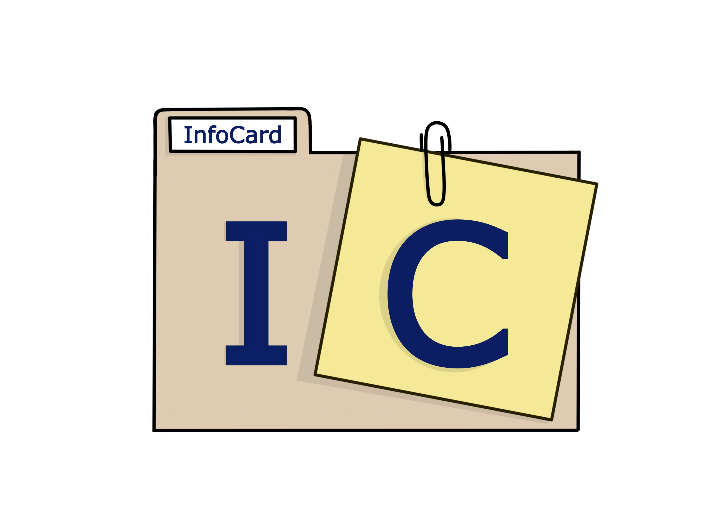

# <a href="https://infocard.herokuapp.com">InfoCard</a>

  

   
  

  

  

   

  

  

Hast du Schwierigkeiten dir Fakten dauerhaft zu merken? Dann bietet dir <a href="https://infocard.herokuapp.com"><strong><em>InfoCard</em></strong></a> die ultimative L&ouml;sung f&uuml;r dein Ged&auml;chtnisproblem!

Egal ob in der Schule, im Studium oder im neuem Job. Oft f&auml;llt es uns schwer die wichtigen Fakten im Ged&auml;chtnis zu behalten.

Logg dich ein und los geht's! Erstelle Themengebiete zu denen du dir etwas merken m&ouml;chtest. Lege dir Karteikarten an und f&uuml;lle sie mit dem altbekannten Frage-Antwortspiel aus.

Du m&ouml;chtest dein Ged&auml;chtnis pr&uuml;fen? Kein Problem, w&auml;hle die gew&uuml;nschten Karteikarten aus und teste, wie gut du bist. Im Ampelsystem* bestimmst du, wie gut du warst und bei welchen Fragen noch Lernbedarf besteht.

Mit <strong><em>InfoCard</em></strong> gibt es keine peinlichen Momente des Vergessens mehr!

\* work in progress

# Authors

<table>
  <tr>
    <td align="center"><a href="https://github.com/MariaHa247"> <b>Maria H.</b></a> <a href="#" title="Code">💻</a> <a href="#" title="Design">🎨</a> <a href="#" title="Ideas, Planning, & Feedback">🤔</a><a href="#" title="Bug reports">🐛</a></td>
    <td align="center"><a href="https://github.com/RiFrost"> <b>Richard F.</b></a> <a href="#" title="Code">💻</a> <a href="#" title="Design">🎨</a> <a href="#" title="Ideas, Planning, & Feedback">🤔</a><a href="#" title="Bug reports">🐛</a></td>
  </tr>
</table>
